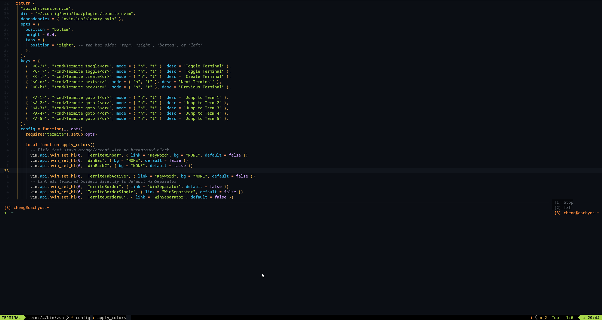
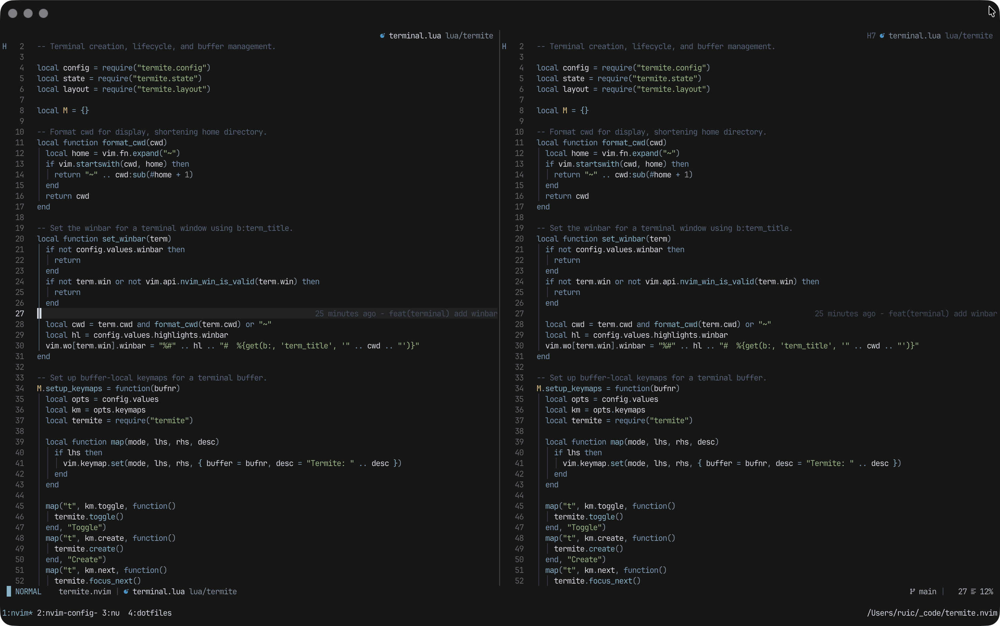

> **Note**: This contains custom quality-of-life enhancements 100% vibe-coded with AI.

## What was added / fixed
- Tmux-style Tabs: Maximizing with multiple terminals opens an interactive tab bar (see screenshot below). Switch tabs using `<C-n>` / `<C-p>` or mouse clicks.
- Direct Terminal Jumping: Jump straight to active terminal using `<A-1>` through`<A-5>` in both Normal and Terminal modes.
- Smart Toggle Memory: Toggling the terminal closed and open remembers your exact state (e.g., stays maximized on terminal 3 instead of resetting).
- Arrow Key Resizing: Adjust panel height or width using `<C-Up>`, `<C-Down>`, `<C-Left>`, and `<C-Right>`.
- Visual Polish: Visual index indicators (`[1]`, `[2]`), clean maximized borders (no ghost borders).



# termite.nvim

Stacking float terminal manager for Neovim.



## Features

- **Vertically stacked floating terminals** on the left or right side of the editor
- **Horizontally stacked floating terminals** on the top or bottom of the editor
- **Toggle all terminals** (show/hide) with a single key
- **Create multiple terminals** that automatically resize and reflow
- **Navigate between terminals** with next/previous keys
- **Maximize/restore** individual terminals to full height/width
- **Tmux-like tab bar** while maximized: switch with next/previous keys or mouse click, dockable to any side
- **Focus editor** while keeping terminals visible, and focus back with a single key
- **Custom shell support** per terminal or global default
- **Full keymap customization**
- **Border highlighting** for active and inactive terminals (customizable)
- **Winbar** showing running process or cwd (customizable)

## Requirements

- Neovim >= 0.7.0

## Installation

Using [lazy.nvim](https://github.com/folke/lazy.nvim):

```lua
{
  "ruicsh/termite.nvim",
  opts = {}
}
```

## Configuration

```lua
require("termite").setup({
  width = 0.5,           -- Fraction of editor width for left/right positions (0.0 - 1.0)
  height = 0.5,          -- Fraction of editor height for top/bottom positions (0.0 - 1.0)
  position = "right",    -- Panel position: "left", "right", "top", or "bottom"
  border = "light",      -- Border style: "light", "heavy", "double", "double-dash", "triple-dash", "quadruple-dash"
  shell = nil,           -- Shell command (nil = default $SHELL)
  start_insert = true,   -- Enter insert mode when focusing a terminal
  click_to_insert = true, -- Enter insert mode when clicking a terminal window
  winbar = true,         -- Show winbar with running process or cwd

  tabs = {
    enabled = true,      -- Show tmux-like tab bar while a terminal is maximized
    position = "right",  -- Tab bar side: "top", "right", "bottom", or "left"
    max_title_width = 20, -- Max display width for the process title in tabs
  },

  keymaps = {
    toggle = "<C-\\>",   -- Toggle all terminals (terminal mode)
    create = "<C-t>",    -- Create new terminal
    next = "<C-n>",      -- Focus next terminal in stack
    prev = "<C-p>",      -- Focus previous terminal in stack
    focus_editor = "<C-e>",  -- Return focus to editor window
    normal_mode = "<C-[>",   -- Exit terminal insert mode
    maximize = "<C-z>",      -- Maximize/restore focused terminal
    close = "q",             -- Close current terminal (normal mode)
    goto_1 = nil,            -- Jump to terminal 1 (e.g. "<A-1>")
    goto_2 = nil,            -- Jump to terminal 2 (e.g. "<A-2>")
    goto_3 = nil,            -- Jump to terminal 3 (e.g. "<A-3>")
    goto_4 = nil,            -- Jump to terminal 4 (e.g. "<A-4>")
    goto_5 = nil,            -- Jump to terminal 5 (e.g. "<A-5>")
  },

  wo = {                 -- Window options applied to terminal windows
    signcolumn = "yes:1",
  },

  highlights = {
    border_single = "TermiteBorderSingle",  -- Highlight for single terminal border (string = hl group, table = direct definition)
    border_active = "TermiteBorder",        -- Highlight for active terminal border (string = hl group, table = direct definition)
    border_inactive = "TermiteBorderNC",    -- Highlight for inactive terminal borders (string = hl group, table = direct definition)
    winbar = "TermiteWinbar",               -- Highlight for winbar
    tab_active = "TermiteTabActive",        -- Highlight for the selected maximized tab
    tab_inactive = "TermiteTabInactive",    -- Highlight for unselected maximized tabs
  },
})
```

## Highlights

termite.nvim uses three highlight groups for terminal window borders:

- `TermiteBorderSingle` - Applied when there's **only one terminal** visible
- `TermiteBorder` - Applied to the **active** (focused) terminal's outer edge when there are **2+ terminals**
- `TermiteBorderNC` - Applied to **inactive** (non-focused) terminal borders

The outer edge is:

- **Left border** when `position = "right"`
- **Right border** when `position = "left"`
- **Top border** when `position = "bottom"`
- **Bottom border** when `position = "top"`

This means only the border facing the editor is highlighted, while the separators between stacked terminals remain dimmed.

### Defaults

By default, the highlight groups link to:

- `TermiteBorderSingle` → `FloatBorder` (single terminal)
- `TermiteBorder` → `FloatBorder` (active terminal outer edge with 2+ terminals)
- `TermiteBorderNC` → `Comment` (inactive terminal outer edges)
- `TermiteWinbar` → `Normal` (winbar text)
- `TermiteTabActive` → `TabLineSel` (selected tab while maximized)
- `TermiteTabInactive` → `TabLine` (unselected tabs while maximized)

These defaults use `default = true`, so they can be overridden by colorschemes or user configuration.

### Customizing in Colorscheme

Define the highlight groups in your colorscheme or init.lua:

```lua
-- Customize single terminal border
vim.api.nvim_set_hl(0, "TermiteBorderSingle", { fg = "#61afef", bg = "NONE" })

-- Customize active terminal border (2+ terminals)
vim.api.nvim_set_hl(0, "TermiteBorder", { fg = "#ff6b6b", bg = "NONE", bold = true })

-- Customize inactive terminal borders
vim.api.nvim_set_hl(0, "TermiteBorderNC", { fg = "#4a4a4a", bg = "NONE" })

-- Customize winbar
vim.api.nvim_set_hl(0, "TermiteWinbar", { fg = "#a0a0a0", bg = "NONE" })

-- Customize maximized tab bar
vim.api.nvim_set_hl(0, "TermiteTabActive", { fg = "#ffffff", bg = "#444444", bold = true })
vim.api.nvim_set_hl(0, "TermiteTabInactive", { fg = "#888888", bg = "NONE" })
```

### Customizing in Setup

You can specify highlights in two ways:

**1. Use custom highlight group names:**

```lua
require("termite").setup({
  highlights = {
    border_single = "MyCustomSingle",
    border_active = "MyCustomActive",
    border_inactive = "MyCustomInactive",
  },
})
```

**2. Define colors directly:**

```lua
require("termite").setup({
  highlights = {
    border_single = { fg = "#61afef", bg = "NONE" },
    border_active = { fg = "#00ff00", bg = "NONE" },
    border_inactive = { fg = "#ff0000", bg = "NONE" },
  },
})
```

## Keymaps

Keymaps are buffer-local to terminal windows and can be customized or disabled.

To disable a keymap, set its value to `false` or `nil`:

```lua
require("termite").setup({
  keymaps = {
    close = false,  -- Disable 'q' to close in normal mode
  },
})
```

Default keymaps:

| Mode     | Key             | Action                                   |
| -------- | --------------- | ---------------------------------------- |
| Terminal | `<C-\>`         | Toggle all terminals (smart: focus back) |
| Terminal | `<C-t>`         | Create new terminal                      |
| Terminal | `<C-n>`         | Focus next terminal                      |
| Terminal | `<C-p>`         | Focus previous terminal                  |
| Terminal | `<C-e>`         | Focus editor window                      |
| Terminal | `<C-[>`         | Exit to normal mode                      |
| Terminal | `<C-z>`         | Maximize/restore terminal                |
| Normal   | `q`             | Close current terminal                   |
| Normal   | `<LeftRelease>` | Enter insert mode on click               | (when click_to_insert = true) |

Additionally, `toggle` and `create` keymaps are available in normal mode globally:

| Mode   | Key     | Action                                   |
| ------ | ------- | ---------------------------------------- |
| Normal | `<C-\>` | Toggle all terminals (smart: focus back) |
| Normal | `<C-t>` | Create new terminal                      |

**Smart toggle behavior:** When terminals are visible and you press `<C-\>` while focus is on the editor, it focuses the terminals instead of hiding them. This lets you switch between editor and terminals with the same key.

**Maximized tab bar:** When a terminal is maximized with 2+ terminals, a tmux-like tab bar lists every terminal (`[1] npm  [2] btop`). The maximized terminal keeps only its outer-edge border facing the editor. `<C-n>` / `<C-p>` cycle the maximized view, clicking a tab jumps to it, creating a terminal appends a tab and switches to it, and closing the maximized terminal keeps you maximized on a neighbor. Toggling off and on remembers the maximized view. Set `tabs.position` to `"top"`, `"right"`, `"bottom"`, or `"left"`, or disable with `tabs = { enabled = false }`.

**Jump to terminal:** `:Termite goto <n>` (or `termite.focus_index(n)`) jumps to the n-th terminal, swapping the maximized view and updating the tab highlight when maximized, and showing hidden terminals first. Bind it directly with the opt-in `goto_1` … `goto_5` keymaps (e.g. `goto_1 = "<A-1>"`), which work in both terminal and normal mode.

## Commands

The `:Termite` command accepts subcommands:

```vim
:Termite              " Toggle all terminals (default)
:Termite toggle       " Toggle all terminals (smart: focuses terminals if in editor)
:Termite create       " Create new terminal
:Termite maximize     " Maximize/restore current terminal
:Termite close        " Close current terminal
:Termite next         " Focus next terminal
:Termite prev         " Focus previous terminal
:Termite goto {n}     " Jump to terminal n (1-based stack index)
:Termite reflow        " Re-sync window geometry (repairs stale floats)
:Termite editor       " Focus editor window
:Termite terminals    " Focus the terminal stack
```

## API

```lua
local termite = require("termite")

-- Configuration
termite.setup(opts)              -- Configure the plugin

-- Terminal management
termite.toggle()                 -- Toggle all terminals (show/hide)
-- Smart toggle: if terminals visible and focus is on editor, focuses terminals
-- otherwise toggles visibility
termite.create()                 -- Create a new terminal
termite.close_current()          -- Close the focused terminal

-- Navigation
termite.focus_next()             -- Focus next terminal in stack (cycles maximized view when maximized)
termite.focus_prev()             -- Focus previous terminal in stack (cycles maximized view when maximized)
termite.focus_index(idx)         -- Focus terminal by stack index (swaps maximized view when maximized, shows hidden terminals first)
termite.focus_editor()           -- Focus editor window
termite.focus_terminals()        -- Focus the terminal stack (last terminal)

-- Window state
termite.toggle_maximize()        -- Maximize/restore focused terminal
termite.refresh_maximized()      -- Re-apply maximized layout and tab bar (e.g. after VimResized)
termite.reflow()                 -- Re-sync all window geometry (repairs stale floats)
```

## Highlight API

```lua
local highlights = require("termite.highlights")

-- Highlight groups
highlights.BORDER_SINGLE         -- "TermiteBorderSingle"
highlights.BORDER_ACTIVE         -- "TermiteBorder"
highlights.BORDER_INACTIVE       -- "TermiteBorderNC"
highlights.WINBAR                 -- "TermiteWinbar"
highlights.TAB_ACTIVE             -- "TermiteTabActive"
highlights.TAB_INACTIVE           -- "TermiteTabInactive"

-- Re-initialize highlight groups (useful after colorscheme change)
highlights.setup()
```

## Testing

Tests use [plenary.nvim](https://github.com/nvim-lua/plenary.nvim). Install it as a dev dependency:

```lua
-- lazy.nvim
{
  "ruicsh/termite.nvim",
  dependencies = { "nvim-lua/plenary.nvim", optional = true },
}
```

Run tests:

```bash
make test                    # Run all tests
make test-file FILE=spec/config_spec.lua  # Run specific test file
```

## License

MIT License - see [LICENSE](LICENSE)
